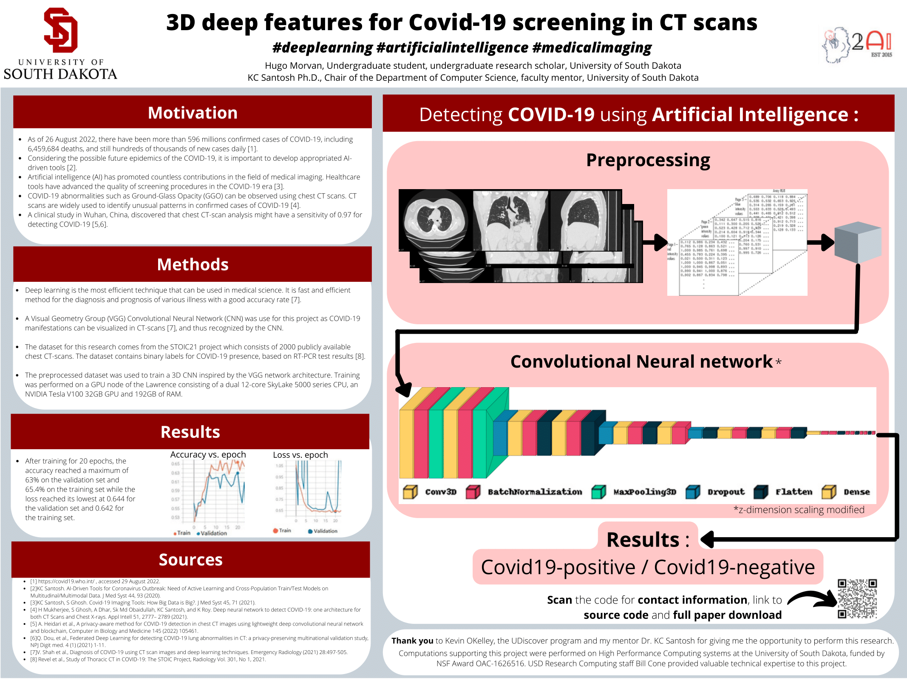

# 3D Deep features for COVID-19 screening in CT-scans

Github repository for my Undergraduate Thesis.

## Introduction

Welcome to this repository about 3D Deep features for COVID-19 screening in CT-scans. Here you will find access to:
* The [original dataset](Dataset/source.md), 
* All of the [source code](code/) used during this project, 
* The [reference papers](references/),
* The full thesis paper (coming soon). 

## Poster

